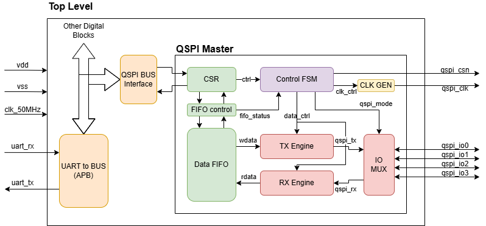

# Project Overview
To design a fully functional 32-bit Quad Serial Peripheral Interface (QSPI) master controller used for communication with external memories. The IP should be entirely synthesizable using standard RTL digital flow with the target process node GF180MCU from GlobalFoundries. The final product should be tested using commercially available flash memory ICs, e.g. S25FL family from Infineon and W25Q family from Winbond.

# Target Specification
- Open-source, modular, and synthesizable
- Compatible with commercial flash memories
- Full support of single, dual, and quad mode (fast, IO, QPI)
- 50MHz target frequency (200Mbps at quad)
- Possible support of Dual Data Rate (DDR)

# Main Architecture
