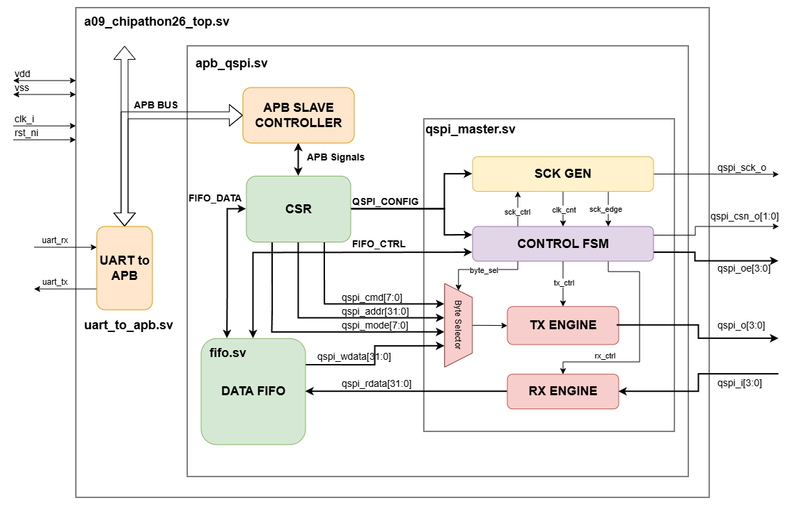

# Project Overview
To design a fully functional 32-bit Quad Serial Peripheral Interface (QSPI) master controller used for communication with external memories. The IP should be entirely synthesizable using standard RTL digital flow with the target process node GF180MCU from GlobalFoundries. The final product should be tested using commercially available flash memory ICs, e.g. S25FL family from Infineon and W25Q family from Winbond.

# Target Specification
- Open-source, modular, and synthesizable
- Compatible with commercial flash memories
- Full support of single, dual, quad, and DDR modes (fast, IO, QPI)
- 50MHz target frequency (200Mbps at quad DDR)

# Main Architecture


# Design Testbench
There are three main testbench for this project, following bottom-up verification:
- [`tb_qspi_master`](sim/cocotb/tb_qspi_master/README.md), a command-specific custom testbench using cocotb and iverilog to test the [`qspi_master`](rtl/qspi_master.sv) core functionality (single, dual, quad, DDR) verified with official flash models (S25FL128S, W25Q65NE, MX25L51245G).
- [`tb_apb_qspi`](sim/cocotb/tb_apb_qspi/README.md), a comprehensive UVM-based testbench using pyUVM to evaluate the APB compliance and the QSPI commands coverage of the [`apb_qspi`](rtl/apb_qspi.sv) module.
- [`tb_top`](sim/cocotb/tb_top/README.md), a quick top level testbench to test top level integration ([`top`](rtl/top.sv)) with full program flow using UART.

More detailed explanations can be found in the respective documentations.

# Design Layout
The design layout is entirely generated through an RTL-to-GDS flow using Librelane 3.0 with the `gf180mcuD` PDK. The Librelane environment is based on the [`chipathon-2026-gf180mcu-padring`](https://github.com/Mauricio-xx/chipathon-2026-gf180mcu-padring.git) repository located inside [`layout/chipathon26-template`](layout/chipathon26-template/). The template uses nix-flake to keep each run reproducible (see setup below). 

## Setup
```bash
# Install nix
curl -L https://nixos.org/nix/install | sh

# Enable flakes
mkdir -p ~/.config/nix && echo 'experimental-features = nix-command flakes' >> ~/.config/nix/nix.conf

# (Optional, but recommended) add user to trusted
echo 'trusted-users = root <username>' | sudo tee -a ~/.config/nix/nix.conf

# Develop environment
cd layout/chipathon26-template
nix develop

# Clone the wafer-space PDK fork
make clone-pdk
```

## Steps
The layout flow consists of three stages: (must be run chronologically)
- Macro Hardening: Hardens the entire design into a single macro ([`a09_chipathon_top`](layout/chipathon26-template/macros/a09_chipathon26_top/a09_chipathon26_top.sv)). See the [LibreLane Config](layout/chipathon26-template/macros/a09_chipathon26_top/config.yaml) and the [Hardened Macro Results](layout/chipathon26-template/macros/a09_chipathon26_top/final/).
- Padring Integration: Places the hardened macro into the `workshop_slot` padring template. See the [LibreLane Config](layout/chipathon26-template/librelane/config.yaml) and the [Final Chip Results](layout/chipathon26-template/final/).
- Gate-Level Simulation (GLS): Runs post-layout verification using Cocotb against the powered netlist (`.pnl.v`) and timing back-annotation (`.sdf`).

```bash
# Make sure to run at the template directory with nix-shell
cd layout/chipathon26-template
nix-shell

# ---- Macro Hardening Flow ---- (10-15 mins full run)
make librelane-macro
make librelane-macro-openroad   # Inspect macro floorplan/routing in OpenROAD GUI
make librelane-macro-klayout    # Inspect final macro GDS in KLayout

# ---- Padring Integration Flow ---- (~1.5 hours full run)
make librelane
make librelane-openroad # Inspect chip-level integration in OpenROAD GUI
make librelane-klayout  # Inspect full-chip signoff GDS in KLayout

# ---- Cocotb Gate-Level Simulation ---- (1-2 mins full run)
make sim-gl             # Zero-delay gate-level simulation with iverilog (default)
make sim-gl SIM=questa  # SDF timing-annotated gate-level simulation with QuestaSim
```

# Documentations
- [QSPI Master Module](docs/qspi_master.md)
- [APB Wrapped QSPI](docs/apb_qspi.md)
- [QSPI CSR](docs/qspi_csr.md)
- [UART FPGA GUI](docs/uart_fpga_gui.md)