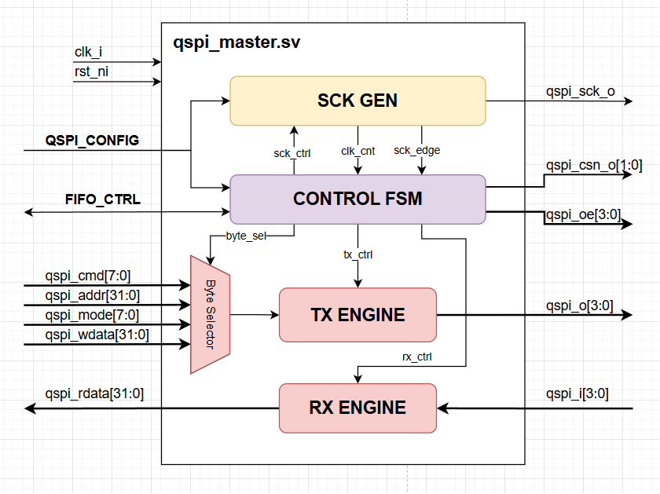

# QSPI Master Module ([`qspi_master.sv`](../rtl/qspi_master.sv))

## Features
- Full support of all single, dual, and quad modes
- Configurable address (3/4 bytes) and data lengths
- Adjustable SCK prescaler (minimum 2) and SCK modes (mode 0/mode 3)
- 32-bit FIFO interface with SCK pause ability when empty/full
- Multiple Chip Selects (CSn) pins
- Little Endian and Big Endian support
- Mode byte (`M[7:0]`) support for eXecute In Place (XIP) operations
- Dual Data Rate (DDR) support

## Configurations
- `qspi_addr_len_i`: address lengths; `1'b0` = 3 bytes addressing, `1'b1` = 4 bytes addressing
- `qspi_dummy_len_i[5:0]`: number of dummy cycles (max 63)
- `qspi_data_len_i[31:0]`: number of data bytes
- `qspi_cmd_mode_i[1:0]`: command mode; `2'b00` = no command, `2'b01` = single mode, `2'b10` = dual mode, `2'b11` = quad mode
- `qspi_addr_mode_i[1:0]`: address mode; `2'b00` = no address, `2'b01` = single mode, `2'b10` = dual mode, `2'b11` = quad mode
- `qspi_data_mode_i[1:0]`: data mode; `2'b00` = no data, `2'b01` = single mode, `2'b10` = dual mode, `2'b11` = quad mode
- `qspi_csn_sel_i[CS_NUM-1:0]`: CSn pin selects (active HIGH)
- `qspi_prescaler_i[7:0]`: SCK prescaler value, SCK freq calculated as `fclk/(prescaler*2+2)`
- `qspi_sck_mode_i`: SCK mode bit; `1'b0` = mode 0, `1'b1` = mode 3
- `qspi_data_dir_i`: data direction bit; `1'b0` = read, `1'b1` = write
- `qspi_endian_i`: endianness bit: `1'b0` = big endian, `1'b1` = little endian
- `qspi_crm_i`: activate continuous read mode bit; more explanation TBA
- `qspi_ddr_i`: activate DDR mode

## [Back to README](../README.md)