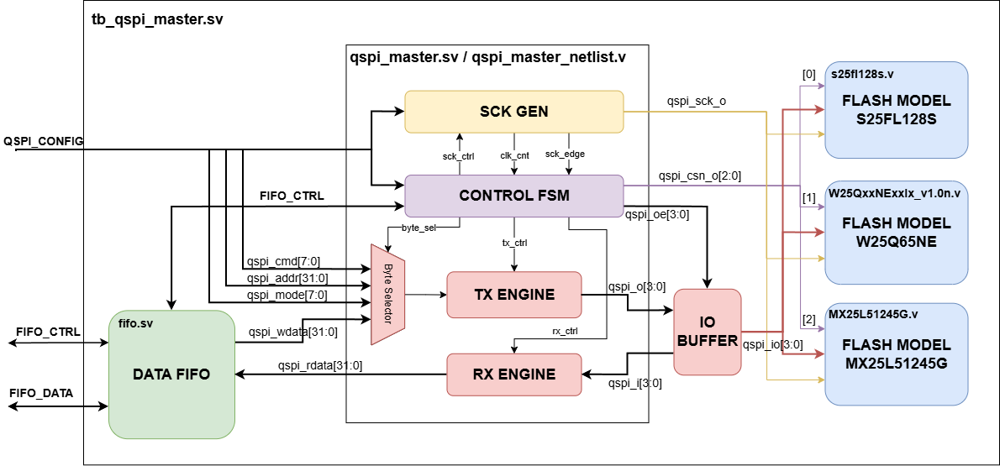

# QSPI Master Testbench - `tb_qspi_master`


## Overview
A custom, highly automated cocotb verification environment designed to test the main `qspi_master` digital block. Instead of basic loopback tests, this testbench directly interfaces the RTL with industry-standard commercial flash memory models (Winbond W25Q, Infineon S25FL, and Macronix MX25L).

## Main Tests
- `test_all_flash_id`, sends the standard 0x9F (Read JEDEC ID) command to all three flash memory models. This serves as the primary sanity check to guarantee base SPI clocking, CSn assertion, and basic RX/TX FIFO operations are functioning perfectly.

- `test_s25fl_read_modes`, focuses on the Infineon S25FL model to rigorously test the read datapath. It validates Normal Read, Fast Read, Dual Output, Dual I/O, Quad Output, Quad I/O, and all DDR modes (Fast DDR, Dual I/O DDR, and Quad I/O DDR). Data is fetched from a .mem initialized file and compared against expected hex values.

- `test_w25q_write_read`, targets the Winbond W25Q model. It runs through all READ mode tests (including support for QPI instructions) as well as the write datapath. For writes, it validates Write Enable (0x06), Sector Erase (0x20), standard Page Program (0x02), and Quad Page Program (0x32), actively polling the WIP (Write In Progress) bit and verifying the data by reading it back.

- `test_mx25l_write_read`, targets the Macronix MX25L model. It executes all READ mode tests along with some random WRITE tests, and explicitly expands on evaluating 4-byte addressing variations.

## Usage and Commands

### Run the standard RTL simulation (All tests):
> *Note: you can open existing `gtkwave_rtl.gtkw` or `gtkwave_gl.gtkw` GTKWave config*
```bash
make 
```

### Run the Gate-Level Simulation (GLS):
> *Note: Could take up minutes*
```bash
make GATELEVEL=1
```

### Run a single specific testcase:
```bash
make TESTCASE=test_all_flash_id
```

### Run specific tests with skipped steps:
```bash
make TESTCASE=test_w25q_write_read SKIP_RANDOM_WRITES=1

make TESTCASE=test_mx25l_write_read SKIP_ALL_READS=1
```


## [Back to `testbench.md`](../../../docs/testbench.md)